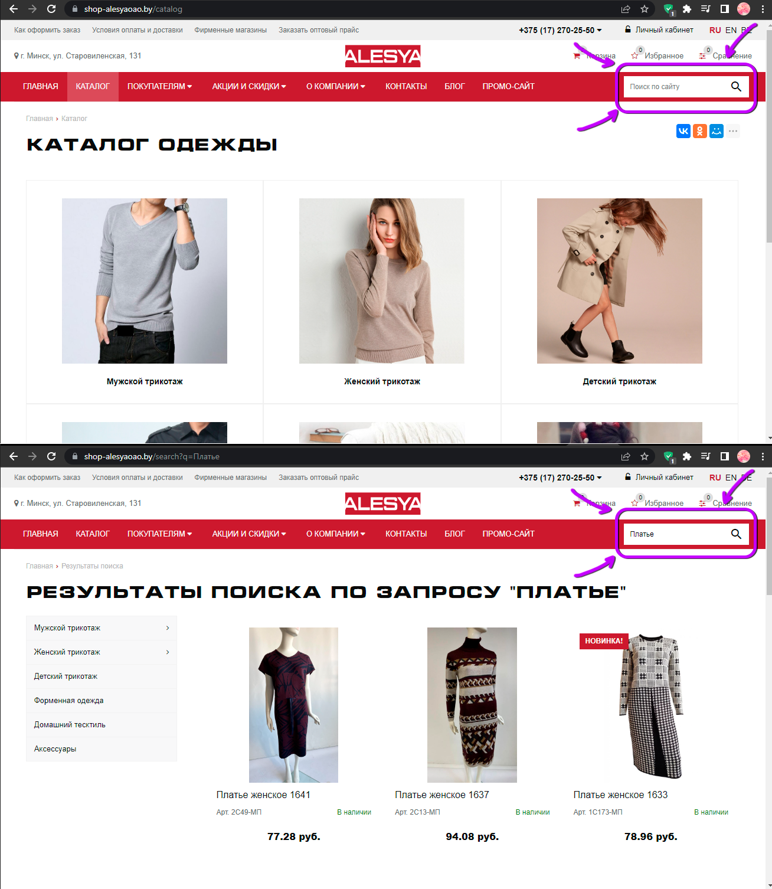
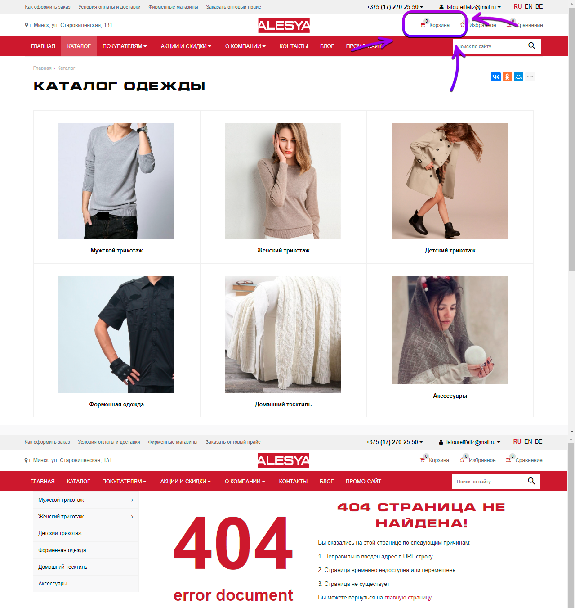
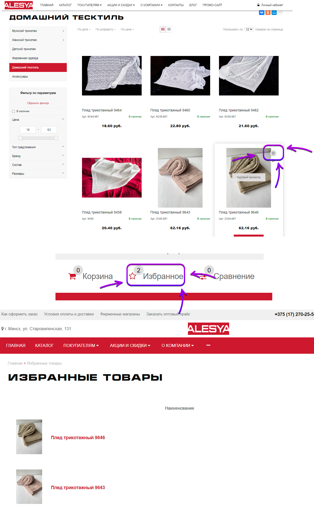
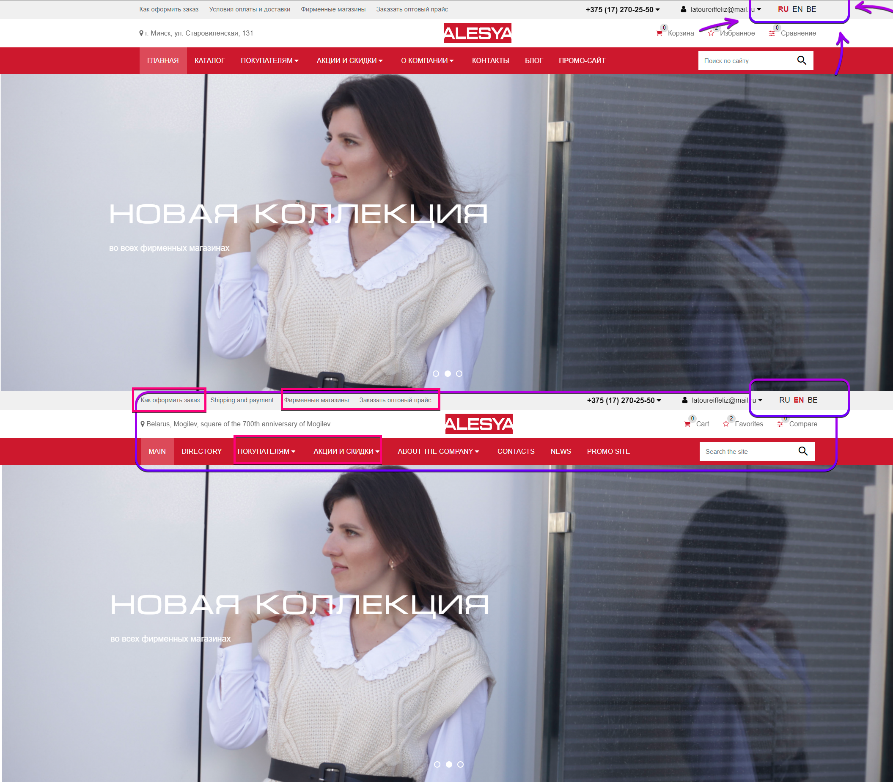
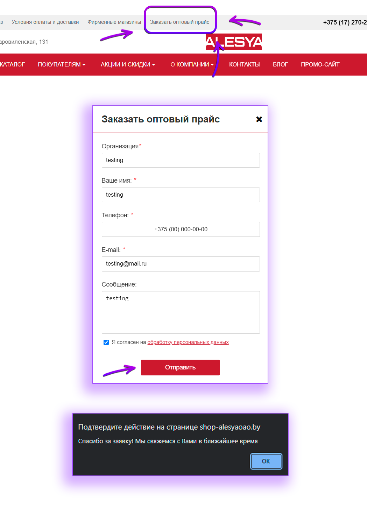
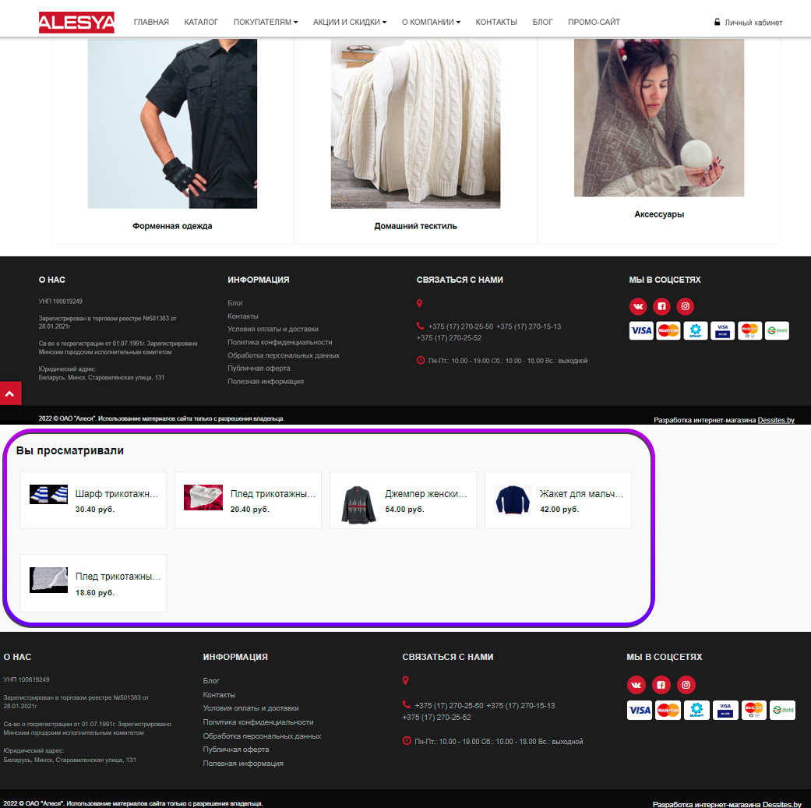
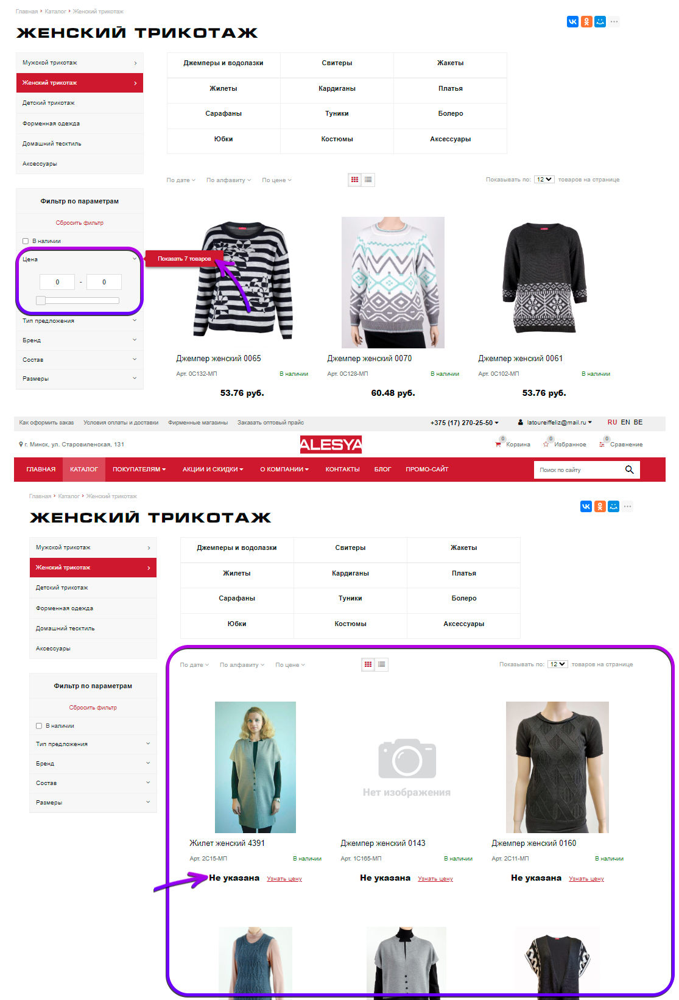

# [ОАО Алеся](https://shop-alesyaoao.by/) test cases
## 1. **_Проверка возможности поиска товаров через "Панель поиска"_**

### Шаг:
1. Посетите сайт.
2. Выделите поле строки поиска, нажав на него.
3. Введите значение "Платье" с помощью клавиатуры и нажмите ввод или на значок поиска.

### Ожидаемый результат:
Отобразились результаты поиска по запросу "Платье".

### Реальный результат:
Отобразились результаты поиска по запросу "Платье".

### Вердикт:
Тест пройден успешно.

## 2. **_Проверка возможности сравнения товаров_**

### Шаг:
1. Посетите каталог.
2. Нажмите на кнопку добавления товаров для сравнения. 
3. Посетите страницу сравнения товаров. 

### Ожидаемый результат:
Отобразились товары для сравнения и их характеристики.

### Реальный результат:
Отобразились товары для сравнения и их характеристики.

### Вердикт:
Тест пройден успешно.

## 3. **_Проверка работоспособности корзины_**

### Шаг:
Посетите страницу корзины. 

### Ожидаемый результат:
Отобразились товары в корзине при их наличии там.

### Реальный результат:
Открылась страница с ошибкой - страница не найдена.

### Вердикт:
Тест не пройден.

## 4. **_Проверка возможности добавления в избранное_**

### Шаг:
1. Посетите каталог.
2. Нажмите на кнопку добавления товаров в избранное. 
3. Посетите страницу "Избранное". 

### Ожидаемый результат:
Отобразились выбранные товары в разделе "Избранное".

### Реальный результат:
Отобразились выбранные товары в разделе "Избранное".

### Вердикт:
Тест пройден успешно.

## 5. **_Проверка реализации локализации_**

### Шаг:
1. Посетите сайт.
2. Нажмите на кнопку необходимого языка.

### Ожидаемый результат:
Основные надписи на сайте стали отображаться на выбранном языке.

### Реальный результат:
Не все основные надписи на сайте отображаются корректно на выбранном языке.

### Вердикт:
Тест не пройден.

## 6. **_Проверка возможности покупки оптом_**

### Шаг:
1. Посетите сайт.
2. Нажмите на кнопку "Заказать оптовый прайс".
3. Введите необходимые данные.
4. Нажмите кнопку "Отправить".

### Ожидаемый результат:
Подтверждение отправки заявки на заказ.

### Реальный результат:
Подтверждение отправки заявки на заказ.

### Вердикт:
Тест пройден успешно.

## 7. **_Проверка невозможности выполнения пустого поиска_**

### Шаг:
1. Посетите сайт.
2. Выделите поле строки поиска, нажав на него.
3. Ничего не вводите и нажмите ввод или на значок поиска.

### Ожидаемый результат:
Отображение сообщения о том, что результатов по данному запросу не найдено.

### Реальный результат:
Отобразилось все товары, добавленные в каталог.

### Вердикт:
Тест не пройден.

## 8. **_Проверка возможности 'Покупки в 1 клик'_**

### Шаг:
1. Посетите каталог.
2. Выберите необходимую категорию и товар или воспользуйтесь поиском в правом верхнем углу.
3. Нажмите кнопку "Купить в 1 клик"
4. Заполните форму для заказа и отправьте.

### Ожидаемый результат:
Подтверждение отправки заявки на заказ.

### Реальный результат:
Подтверждение отправки заявки на заказ.

### Вердикт:
Тест пройден успешно.

## 9. **_Проверка отображения раздела 'Вы просматривали'_**

### Шаг:
1. Посетите каталог.
2. Просмотрите несколько товаров.

### Ожидаемый результат:
Отображение просмотренных недавно товаров в разделе "Вы просматривали".

### Реальный результат:
Отображение просмотренных недавно товаров в разделе "Вы просматривали".

### Вердикт:
Тест пройден успешно.

## 10. **_Проверка корректной работы фильтров (мин./макс. цена)_**

### Шаг:
1. Посетите каталог.
2. Поставьте нуль как значение минимальной и максимальной цены товаров.

### Ожидаемый результат:
Отображение сообщения о том, что подходящих результатов не найдено.

### Реальный результат:
Отображение товаров с значением цены "Не указана".

### Вердикт:
Тест не пройден.

